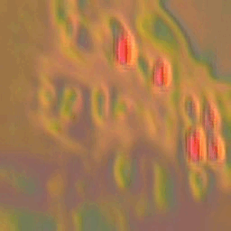
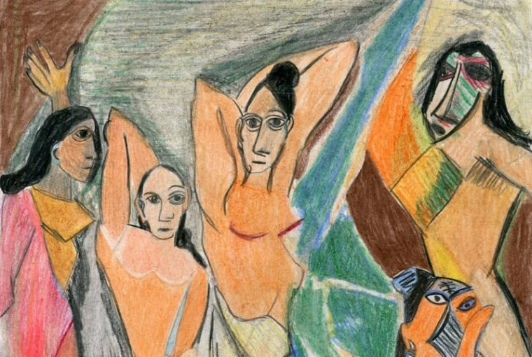

## DashToon Assignment

This repository implements the paper Perceptual Losses for Real-Time Style Transfer
and Super-Resolution by Johnson et al.

To run these scripts first create a conda environment using the `requirements.txt` file using the command 

```
conda create --name <env_name> --file requirements.txt
```

The `data/train/` directory should contain extracted images from the MSCOCO dataset which can be downloaded from [MSCOCO-2014 Train](http://images.cocodataset.org/zips/train2014.zip).

Launch `jupyter-notebook` and run cells in the `style_transfer_picasso.ipynb` file or alternatively the entire training can be run using the command

```
python3 train.py
```

This GIF shows the output of the network on an unseen image over the iterations as the network trained. 
<br>

 
 



The model with the best validation loss is saved as `best_model.pth`

